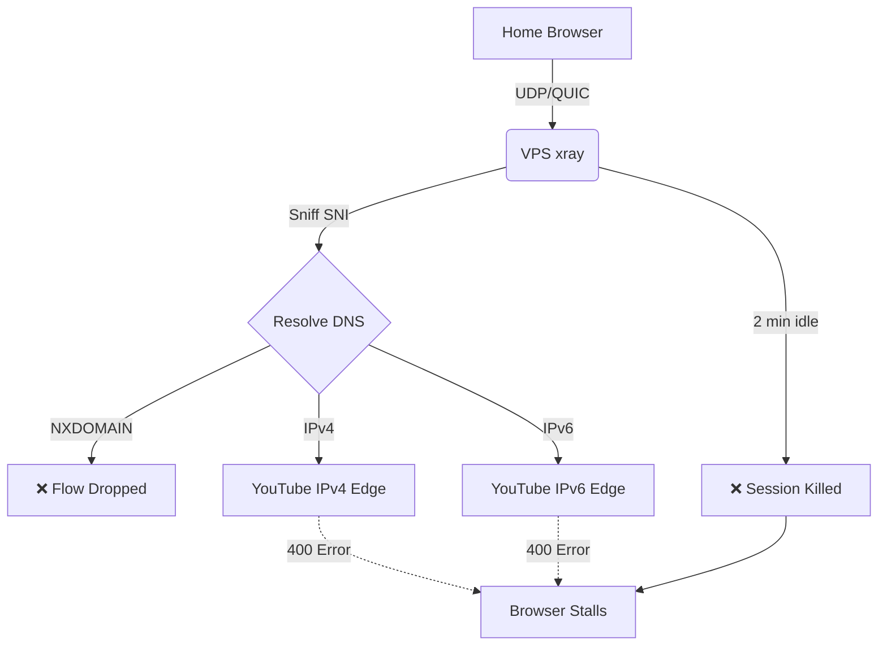
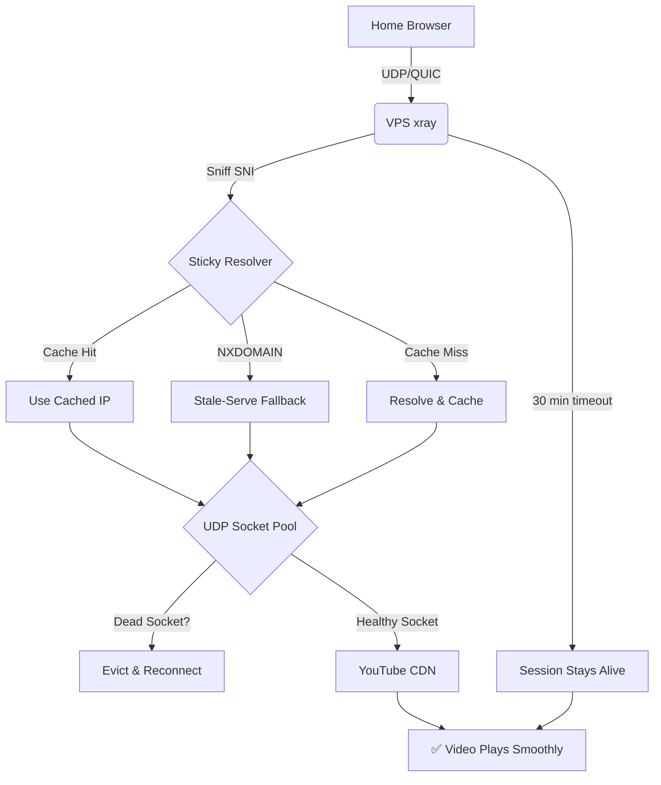

# Project X

## Fork Features: Transparent QUIC Proxying (cddeppe/Xray-core)

This fork solves a long-standing problem in the xray community: **how to transparently proxy QUIC/HTTP3 traffic (like YouTube) through a multi-hop chain without client-side certificates, TUN adapters, or DNS-to-VPS forwarding.**

Standard xray fails in this scenario because it is a Layer-4 proxy, but QUIC is a Layer-7 protocol with strict connection validation. This fork bridges that gap.

### The Problem

When you use DNS hijacking (e.g., Control D) to point `youtube.com` to your VPS, the browser sends QUIC packets to the VPS. xray sniffs the SNI and tries to forward the packet. However, it fails due to four architectural limitations:

1. **2-Minute Session Timeout:** xray kills UDP sessions after 2 minutes of inactivity. Video buffering pauses kill the session.
2. **IPv4/IPv6 Flipping:** xray re-resolves DNS per flow, randomly picking IPv4 or IPv6. YouTube validates the source IP and rejects mismatches (400 errors).
3. **NXDOMAIN Edge Rotation:** YouTube rotates CDN hostnames faster than public DNS caches them. xray tries to resolve a new hostname, gets NXDOMAIN, and drops the flow.
4. **Per-Connection Overhead:** Each new flow creates a new outbound socket. If a CDN edge dies, the socket stays open and continues to fail.

### The Solution

This fork introduces four new features to solve these problems:

1. **Extended UDP Timeout:** The hardcoded 2-minute timeout in `worker.go` is increased to 30 minutes.
2. **Sticky Resolver (`udp_sticky.go`):** Caches the first DNS resolution per hostname. If DNS fails (NXDOMAIN), it falls back to the last known-good IP for the domain suffix (stale-serve). Includes Wildcard Caching (`*.googlevideo.com`) with a 60-second TTL and background refresh (stale-while-revalidate). Supports IPv4/IPv6 preference flags.
3. **UDP Socket Pool (`udp_pool.go`):** Pools outbound sockets by destination IP. Includes **Dead Socket Detection** (marks sockets dead on read/write errors), a 30-second staleness check for silently dropped connections, and an **Idle Reaper** (evicts sockets idle >10min or unused >5min).
4. **QUIC CID Migration (`worker.go`):** Tracks QUIC Connection IDs. If a client migrates (NAT rebinding, CID rotation), the existing outbound socket is preserved.

All features are configured via the `udpConfig` field in the freedom outbound JSON config:

```json
{
  "protocol": "freedom",
  "settings": {
    "udpConfig": {
      "enableSocketPool": true,
      "enableStickyResolver": true,
      "preferIpv4": true
    }
  }
}
```

### Architecture Diagrams

#### 1. The Problem: Standard Xray (Failing)



#### 2. The Solution: This Fork (Working)



### How It Works

#### Sticky Resolver with Stale-While-Revalidate (`udp_sticky.go`)

When a new UDP flow arrives, the sticky resolver checks if the hostname is cached.
- If yes, it returns the cached IP (no DNS lookup needed).
- If no, it resolves the hostname, caches the IP, and returns it.
- If DNS returns NXDOMAIN, it falls back to the last known-good IP for the domain suffix (e.g., `*.googlevideo.com`).
- **Wildcard Caching:** Caches `*.googlevideo.com` with a 60-second TTL. When it expires, it returns the stale IP immediately AND triggers a background DNS refresh (stale-while-revalidate) to get a live edge IP.
- **IPv4/IPv6 Preference:** Supports `XRAY_UDP_PREFER_IPV4=1` or `XRAY_UDP_PREFER_IPV6=1` to force the resolver to only pick addresses from the preferred family, eliminating "Happy Eyeballs" flipping entirely.

This prevents the IPv4/IPv6 flipping and NXDOMAIN errors.

#### UDP Socket Pool with Dead Socket Detection (`udp_pool.go`)

When a new UDP flow arrives, the pool checks if a socket to the destination IP already exists.
- If yes, it reuses the socket (no new socket creation).
- If no, it creates a new socket and caches it.
- **Dead Socket Detection:** If a socket read or write fails, it marks the socket as dead. The next flow creates a fresh socket.
- **Staleness Check:** If a socket hasn't received a reply in 30 seconds, it is marked dead and evicted.
- **Idle Reaper:** A background goroutine evicts sockets that have been idle (no replies in 10 min) or unused (refCount=0 for 5 min).

This prevents the per-connection overhead and handles CDN edge rotation.

#### 30-Minute UDP Timeout (`worker.go`)

The standard 2-minute timeout in `worker.go` kills UDP sessions during video buffering. This fork increases it to 30 minutes.

#### QUIC CID Migration (`worker.go`)

If a QUIC client migrates (NAT rebinding, CID rotation), xray tracks the new Connection ID and preserves the existing outbound socket. The destination server sees a consistent source IP.

### Build and Install

```bash
# AMD64
GOOS=linux GOARCH=amd64 CGO_ENABLED=0 go build -o xray-fork-amd64 ./main

# ARM64
GOOS=linux GOARCH=arm64 CGO_ENABLED=0 go build -o xray-fork-arm64 ./main

# Install
sudo cp xray-fork-<arch> /usr/local/bin/xray
```

### Configuration

Add the `udpConfig` block to your freedom outbound in your xray config JSON. No environment variables needed.

```bash
# Create systemd drop-in
[Service]
EOF
```

### Configuration Requirements

Add the `udpConfig` block to your freedom outbound in your xray config JSON. No environment variables needed.

Your xray config must have:
1. **UDP enabled on port 443 inbounds:** `"network": "tcp,udp"`
2. **QUIC allowed in routing:** (Do NOT block `protocol: "quic"`)
3. **Policy with long idle timeout:** `"policy": {"levels": {"0": {"connIdle": 1800}}}`

### See HANDOFF.md for full architecture, design notes, and deployment details.


## Support

If this fork saves you time and you want to support its maintenance, feel free to buy me a coffee:

[](https://ko-fi.com/cdeppe)


### License

Mozilla Public License Version 2.0 (inherits from xray-core).


## Support

If this fork saves you time and you want to support its maintenance, feel free to buy me a coffee:

[](https://ko-fi.com/cdeppe)


## License

[Mozilla Public License Version 2.0](https://github.com/XTLS/Xray-core/blob/main/LICENSE)

## Documentation

[Project X Official Website](https://xtls.github.io)
