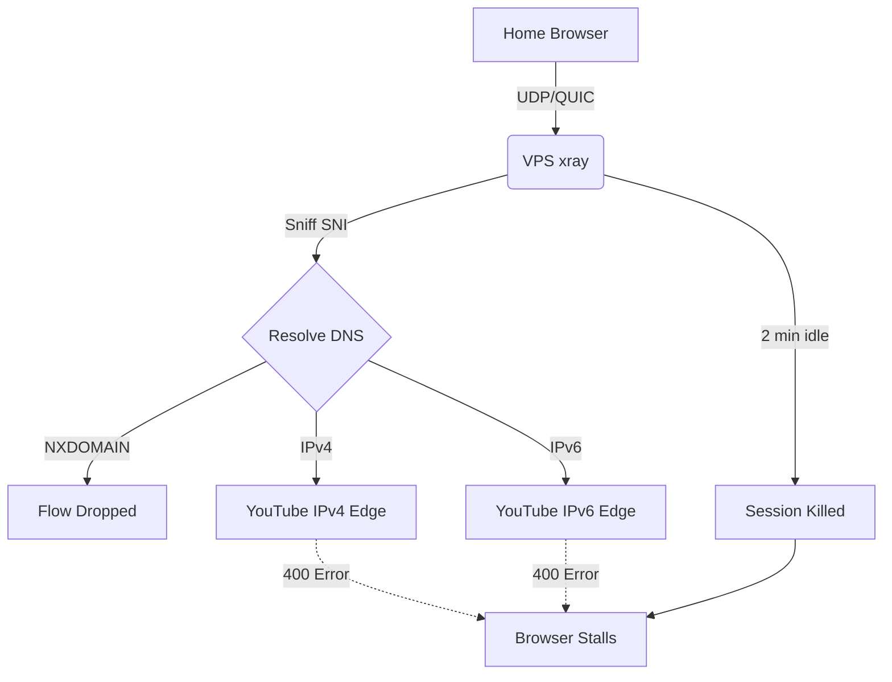
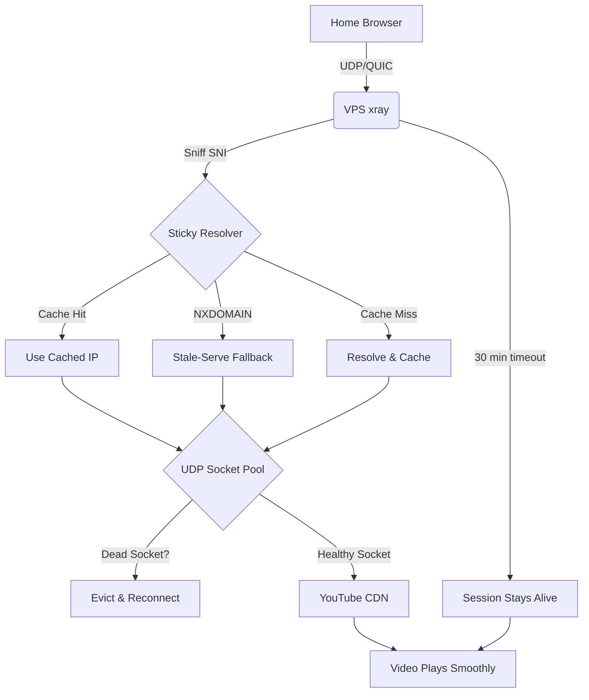

# Xray-quiclink

A fork of [Xray-core](https://github.com/XTLS/Xray-core) focused on **multi-hop transparent proxying with deterministic source-IP handling**. Originally built to solve QUIC/HTTP3 proxying through a multi-hop chain (Home -> vps1 -> vps2 -> YouTube), now also supports multi-IP inbound listen and outbound source-IP binding.

## Fork Features

### 1. Transparent QUIC Proxying (since v26.9.9)

Solves how to transparently proxy QUIC/HTTP3 traffic (like YouTube) through a multi-hop chain without client-side certificates, TUN adapters, or DNS-to-VPS forwarding.

Standard xray fails in this scenario because it is a Layer-4 proxy, but QUIC is a Layer-7 protocol with strict connection validation. This fork bridges that gap.

**Four architectural limitations solved:**

1. **2-Minute Session Timeout:** xray kills UDP sessions after 2 minutes of inactivity. Video buffering pauses kill the session. **Fix:** Extended to 30 minutes.
2. **IPv4/IPv6 Flipping:** xray re-resolves DNS per flow, randomly picking IPv4 or IPv6. YouTube validates the source IP and rejects mismatches (400 errors). **Fix:** Sticky resolver with IPv4/IPv6 preference.
3. **NXDOMAIN Edge Rotation:** YouTube rotates CDN hostnames faster than public DNS caches them. xray tries to resolve a new hostname, gets NXDOMAIN, and drops the flow. **Fix:** Sticky resolver with wildcard cache + stale-while-revalidate.
4. **Per-Connection Overhead:** Each new flow creates a new outbound socket. If a CDN edge dies, the socket stays open and continues to fail. **Fix:** UDP socket pool with dead-socket detection.

### 2. Multi-IP Inbound Listen (v26.10.0)

The `listen` field on inbounds now accepts an **array** of IPs, producing one inbound handler per IP. Backward compatible with the single-string form.

```json
"listen": ["192.0.2.10", "2001:db8::10"]
```

Produces two underlying handlers with synthesized tags `<tag>#<ip>` so routing can target each individually. Consolidates configs from N*2 inbounds (one per IP per port) down to N inbounds (one per port, multi-IP).

**Why:** Servers with multiple public IPs (up to 10+) previously needed one inbound config per IP per port. A 6-IP server with 8 ports needed 96 inbound entries. With multi-IP listen, it needs 8 inbound entries — one per port, each listing all 6 IPs.

### 3. Deterministic Outbound Source IP (v26.10.1 + v26.10.2)

For servers with multiple public IPs, the kernel might pick a different source IP than the one the client connected to. `sendThrough: "origin"` forces the outbound dial's source IP to match the inbound listen IP.

**Four patches make this safe:**

1. **`transport/internet/system_dialer.go`** -- `resolveSrcAddr` now takes `dest` as a second argument and returns nil (let kernel pick source) when:
   - `src` is nil or wildcard (AnyIP/AnyIPv6)
   - `dest` is loopback and `src` is non-loopback (would EADDRNOTAVAIL)
   - `src` and `dest` are IPs of different families (would EADDRNOTAVAIL)

2. **`transport/internet/dialer.go`** -- `LookupForIP` now queries both A and AAAA records regardless of `localAddr` family. Previously, when a source IP was set, only the matching family was queried -- so IPv6 source + IPv4-only destination returned empty DNS response and the dial failed. Now the DNS query returns whatever the domain has, and the family-mismatch guard in `resolveSrcAddr` handles the source-binding decision.

3. **`app/proxyman/outbound/handler.go`** -- `isLoopbackDestination` guard prevents `SetOutboundGateway` from being called when the destination is loopback (127.0.0.0/8, ::1, localhost). This prevents EADDRNOTAVAIL when the dokodemo default destination is 127.0.0.1:443 (when SNI sniffing fails and no explicit `address` is set in the inbound).

4. **`proxy/freedom/freedom.go`** -- **TCP/UDP separation** (v26.10.2). `SetOutboundGateway` is only called for TCP, or for UDP when the socket pool is NOT enabled. When the UDP pool is enabled, `outGateway` stays nil so the pool's wildcard-bound sockets are used for DCID demuxing. This is critical because:

   - **TCP**: Each connection is a dedicated stream. Source IP can be bound per-connection via `dialer.LocalAddr`. `sendThrough: origin` works cleanly.
   - **UDP/QUIC**: Multiple QUIC sessions share the same outbound socket in the pool, demuxed by DCID. The pool socket is wildcard-bound -- it can't bind a specific source IP. If `sendThrough` were applied to UDP, the pool would be bypassed, and QUIC packets would fall back to per-session sockets without DCID demuxing. When SNI sniffing fails (200ms timeout), the destination stays at 127.0.0.1:443 (dokodemo default), creating a dial-self loop that freezes YouTube.

   **The fix**: `sendThrough: origin` is applied to TCP only. UDP uses the pool (when `enableSocketPool: true`), which handles DCID demuxing and doesn't depend on SNI sniffing.

**Why `domainStrategy: useip` is required in the outbound's sockopt:**

`sendThrough: origin` needs the destination resolved to an IP *before* the system dialer runs, so the family-mismatch guard in `resolveSrcAddr` can compare the source and destination families. Without `useip`, the destination stays a domain and the guard can't run -- leading to "no suitable address found" errors for cross-family dials (e.g., IPv6 listen IP + IPv4-only destination).

**None of these patches touch the dispatcher, sniffer, inbound worker, routing, or config parser** -- so SNI sniffing is unaffected by construction.

### The Problem (Detailed)

When you use DNS hijacking (e.g., Control D) to point `youtube.com` to your VPS, the browser sends QUIC packets to the VPS. xray sniffs the SNI and tries to forward the packet. However, it fails due to four architectural limitations:

1. **2-Minute Session Timeout:** xray kills UDP sessions after 2 minutes of inactivity. Video buffering pauses kill the session.
2. **IPv4/IPv6 Flipping:** xray re-resolves DNS per flow, randomly picking IPv4 or IPv6. YouTube validates the source IP and rejects mismatches (400 errors).
3. **NXDOMAIN Edge Rotation:** YouTube rotates CDN hostnames faster than public DNS caches them. xray tries to resolve a new hostname, gets NXDOMAIN, and drops the flow.
4. **Per-Connection Overhead:** Each new flow creates a new outbound socket. If a CDN edge dies, the socket stays open and continues to fail.

### The Solution

This fork introduces four new features to solve these problems:

1. **Extended UDP Timeout:** The hardcoded 2-minute timeout in `worker.go` is increased to 30 minutes.
2. **Sticky Resolver (`udp_sticky.go`):** Caches the first DNS resolution per hostname. If DNS fails (NXDOMAIN), it falls back to the last known-good IP for the domain suffix (stale-serve). Includes Wildcard Caching (`*.googlevideo.com`) with a 60-second TTL and background refresh (stale-while-revalidate). Supports IPv4/IPv6 preference flags (`preferIpv4`, `preferIpv6`) -- as of v26.10.3, the resolver actually scans DNS results and picks the first address matching the preferred family (previously it picked `addrs[0]` regardless of preference, often selecting IPv6 when IPv4 was preferred).
3. **UDP Socket Pool (`udp_pool.go`):** Pools outbound sockets by destination IP. Includes **Dead Socket Detection** (marks sockets dead on read/write errors), a 5-minute staleness check for silently dropped connections (increased from 30 seconds in v26.10.4 to prevent stalls during YouTube buffering pauses), and an **Idle Reaper** (evicts sockets idle >10min or unused >5min). Demuxes QUIC by DCID (Connection ID), so reply packets are routed to the correct session even when SNI sniffing fails.
4. **QUIC CID Migration (`worker.go`):** Tracks QUIC Connection IDs. If a client migrates (NAT rebinding, CID rotation), the existing outbound socket is preserved.

All features are configured via the `udpConfig` field in the freedom outbound JSON config:

```json
{
  "protocol": "freedom",
  "settings": {
    "udpConfig": {
      "enableSocketPool": true,
      "enableStickyResolver": true,
      "preferIpv4": true
    }
  }
}
```

### Architecture Diagrams

#### 1. The Problem: Standard Xray (Failing)



#### 2. The Solution: This Fork (Working)



### How It Works

#### Sticky Resolver with Stale-While-Revalidate (`udp_sticky.go`)

When a new UDP flow arrives, the sticky resolver checks if the hostname is cached.
- If yes, it returns the cached IP (no DNS lookup needed).
- If no, it resolves the hostname, caches the IP, and returns it.
- If DNS returns NXDOMAIN, it falls back to the last known-good IP for the domain suffix (e.g., `*.googlevideo.com`).
- **Wildcard Caching:** Caches `*.googlevideo.com` with a 60-second TTL. When it expires, it returns the stale IP immediately AND triggers a background DNS refresh (stale-while-revalidate) to get a live edge IP.
- **IPv4/IPv6 Preference:** Supports `preferIpv4: true` or `preferIpv6: true` to force the resolver to only pick addresses from the preferred family, eliminating "Happy Eyeballs" flipping entirely.

This prevents the IPv4/IPv6 flipping and NXDOMAIN errors.

#### UDP Socket Pool with Dead Socket Detection (`udp_pool.go`)

When a new UDP flow arrives, the pool checks if a socket to the destination IP already exists.
- If yes, it reuses the socket (no new socket creation).
- If no, it creates a new socket and caches it.
- **Dead Socket Detection:** If a socket read or write fails, it marks the socket as dead. The next flow creates a fresh socket.
- **Staleness Check:** If a socket hasn't received a reply in 30 seconds, it is marked dead and evicted.
- **Idle Reaper:** A background goroutine evicts sockets that have been idle (no replies in 10 min) or unused (refCount=0 for 5 min).
- **DCID Demuxing:** The pool reads QUIC Connection IDs from packets and routes reply packets to the correct session. This means the pool works even when SNI sniffing fails -- the packet is forwarded to the destination based on the DCID, not the SNI.

This prevents the per-connection overhead and handles CDN edge rotation.

#### 30-Minute UDP Timeout (`worker.go`)

The standard 2-minute timeout in `worker.go` kills UDP sessions during video buffering. This fork increases it to 30 minutes.

#### QUIC CID Migration (`worker.go`)

If a QUIC client migrates (NAT rebinding, CID rotation), xray tracks the new Connection ID and preserves the existing outbound socket. The destination server sees a consistent source IP.

### Multi-IP Inbound + Deterministic Source IP (v26.10.0 + v26.10.1 + v26.10.2)

#### Multi-IP Inbound Listen

The `listen` field on `InboundDetourConfig` now accepts either a single string (backward compatible) or an array of strings. Each IP in the array produces one underlying inbound handler, with a synthesized tag of the form `<originalTag>#<ip>`.

```json
{
  "listen": ["192.0.2.10", "2001:db8::10"],
  "port": 443,
  "protocol": "dokodemo-door",
  "tag": "in-443",
  "settings": { "network": "tcp,udp" },
  "sniffing": { "enabled": true, "destOverride": ["tls", "quic"] }
}
```

Produces two handlers: `in-443#192.0.2.10` and `in-443#2001:db8::10`. Routing rules can target each individually, or use the original tag for the first IP.

#### Deterministic Outbound Source IP (`sendThrough: "origin"`)

For servers with multiple public IPs, the kernel might pick a different source IP than the one the client connected to. `sendThrough: "origin"` forces the outbound dial's source IP to match the inbound listen IP:

```json
{
  "protocol": "freedom",
  "tag": "direct",
  "sendThrough": "origin",
  "streamSettings": {
    "sockopt": {
      "domainStrategy": "useip",
      "tcpFastOpen": true,
      "tcpNoDelay": true,
      "tcpUserTimeout": 5000,
      "tcpKeepAlive": 60
    }
  },
  "settings": {
    "udpConfig": {
      "enableSocketPool": true,
      "enableStickyResolver": true,
      "preferIpv4": true
    }
  }
}
```

**How it works (TCP vs UDP):**

| Network | sendThrough applied? | Source IP | Pool used? | Why |
|---------|---------------------|-----------|------------|-----|
| TCP | Yes | Listen IP (via `dialer.LocalAddr`) | N/A (TCP has no pool) | Each TCP connection gets its own socket; source IP can be bound per-connection |
| UDP + pool enabled | No | Kernel-chosen (wildcard) | Yes (DCID demux) | Pool uses wildcard-bound sockets for DCID demuxing; can't bind specific source IP |
| UDP + pool disabled | Yes | Listen IP (per-session socket) | No | Per-session socket can bind source IP, but no DCID demuxing |

**Why UDP skips sendThrough when the pool is enabled:**

The UDP pool uses a single wildcard-bound socket per destination IP. Multiple QUIC sessions to the same destination share this socket, demuxed by QUIC Connection ID (DCID). This is essential for YouTube because:

1. YouTube creates many simultaneous QUIC flows (video, audio, chat, ads)
2. When SNI sniffing fails (200ms timeout), the destination stays at the dokodemo default (127.0.0.1:443)
3. Without the pool's DCID demuxing, each flow gets its own per-session socket that dials 127.0.0.1:443 -- creating a dial-self loop that freezes YouTube
4. The pool's DCID demuxing routes packets correctly even when sniffing fails, because it uses the DCID (not the SNI) to identify the session

If `sendThrough: origin` were applied to UDP, `outGateway` would be non-nil, the pool would be bypassed, and QUIC would fall back to per-session sockets -- breaking YouTube.

**Why `domainStrategy: useip` is required:**

`sendThrough: origin` needs the destination resolved to an IP before the system dialer runs, so the family-mismatch guard can compare source and destination families. Without `useip`, the destination stays a domain and the guard can't run. For example: IPv6 listen IP + IPv4-only destination (like zattoo.com) would fail with "no suitable address found" because the system dialer tries to bind an IPv6 source to an IPv4 destination.

With `useip`, xray resolves the domain via its internal DNS (querying both A and AAAA records), then passes the resolved IP to `resolveSrcAddr`. The family-mismatch guard sees the mismatch and returns nil (let the kernel pick an IPv4 source), so the dial succeeds.

### Build and Install

Pre-built binaries are available on the [releases page](https://github.com/cddeppe/xray-quiclink/releases).

```bash
# Download from latest release (AMD64)
wget https://github.com/cddeppe/xray-quiclink/releases/latest/download/xray-linux-amd64 -O xray
chmod +x xray
sudo cp xray /usr/local/bin/xray

# Or build from source
GOOS=linux GOARCH=amd64 go build -o xray ./main      # AMD64
GOOS=linux GOARCH=arm64 go build -o xray ./main      # ARM64
sudo cp xray /usr/local/bin/xray
```

### Release Tags

- `v26.9.9-udp-fork` -- original UDP/QUIC fork (sticky resolver, socket pool, CID migration, 30-min timeout)
- `v26.10.0-link` -- adds multi-IP inbound listen (`listen: [ip1, ip2]`)
- `v26.10.1-link` -- adds safe `sendThrough: origin` (family-mismatch + loopback guards, both-family DNS lookup)
- `v26.10.2-link` -- separates TCP/UDP sendThrough (TCP honors source-IP binding, UDP uses pool for DCID demuxing)
- `v26.10.3-link` -- fixes sticky resolver to honor `preferIpv4`/`preferIpv6` (was picking `addrs[0]` regardless)
- `v26.10.4-link` -- increases pool staleness timeout from 30s to 5min (prevents YouTube stalls during buffering)
- `v26.10.5-link` -- configurable UDP timeouts via JSON config (`sessionIdleTimeout`, `poolStalenessTimeout`, `poolIdleTimeout`, `poolUnusedTimeout`)
- `v26.10.6-link` -- 4 bug fixes from code review (non-QUIC UDP sendThrough, dcidHex panic, empty DCID guards)
- `v26.10.7-link` -- TTL for exact-match DNS cache entries (stale-while-revalidate, prevents CDN edge rotation failures)

### Configuration

See the sanitized example config for a complete working example (uses documentation IP ranges 192.0.2.0/24 and 2001:db8::/32, not real IPs). Key points:

1. **Multi-IP inbound listen:** `listen: [v4-ip, v6-ip]` consolidates per-IP inbounds into one block.
2. **`portMap` for multi-port:** A single inbound can listen on multiple ports and forward each to a different destination.
3. **`sendThrough: origin` on freedom outbound:** Binds outbound source IP to inbound listen IP. TCP always honors sendThrough. UDP honors sendThrough for non-QUIC traffic; QUIC uses the pool (when `enableSocketPool: true`) with DCID demuxing (v26.10.2+). Non-QUIC UDP also honors sendThrough when the pool is enabled (v26.10.6 fix).
4. **`domainStrategy: useip` in freedom's sockopt:** Resolves destination to IP before dialing (required for family-mismatch guard).
5. **`udpConfig` for QUIC:** `enableSocketPool`, `enableStickyResolver`, `preferIpv4` for the YouTube/QUIC chain. Configurable timeouts (v26.10.5+):
   ```json
   "udpConfig": {
     "enableSocketPool": true,
     "enableStickyResolver": true,
     "preferIpv4": true,
     "sessionIdleTimeout": 1800,
     "poolStalenessTimeout": 300,
     "poolIdleTimeout": 600,
     "poolUnusedTimeout": 300
   }
   ```
   All values in seconds. Omit or set 0 to use defaults:
   - `sessionIdleTimeout`: 1800 (30 min) -- UDP session idle timeout
   - `poolStalenessTimeout`: 300 (5 min) -- pool socket staleness check
   - `poolIdleTimeout`: 600 (10 min) -- pool socket idle eviction
   - `poolUnusedTimeout`: 300 (5 min) -- pool socket unused eviction
6. **UDP enabled on port 443 inbounds:** `network: tcp,udp`
7. **QUIC allowed in routing:** (Do NOT block `protocol: quic`)
8. **Policy with long idle timeout:** `policy: {levels: {0: {connIdle: 1800}}}`

### See HANDOFF.md for full architecture, design notes, and deployment details.

## Support

If this fork saves you time and you want to support its maintenance, feel free to buy me a coffee:

[](https://ko-fi.com/cdeppe)

## License

[Mozilla Public License Version 2.0](https://github.com/XTLS/Xray-core/blob/main/LICENSE)

## Documentation

[Project X Official Website](https://xtls.github.io)
