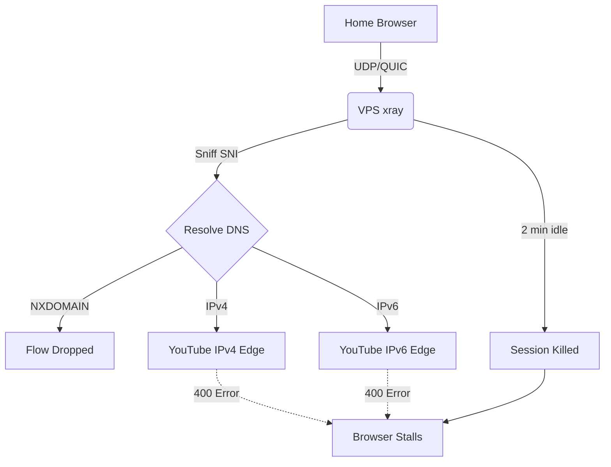
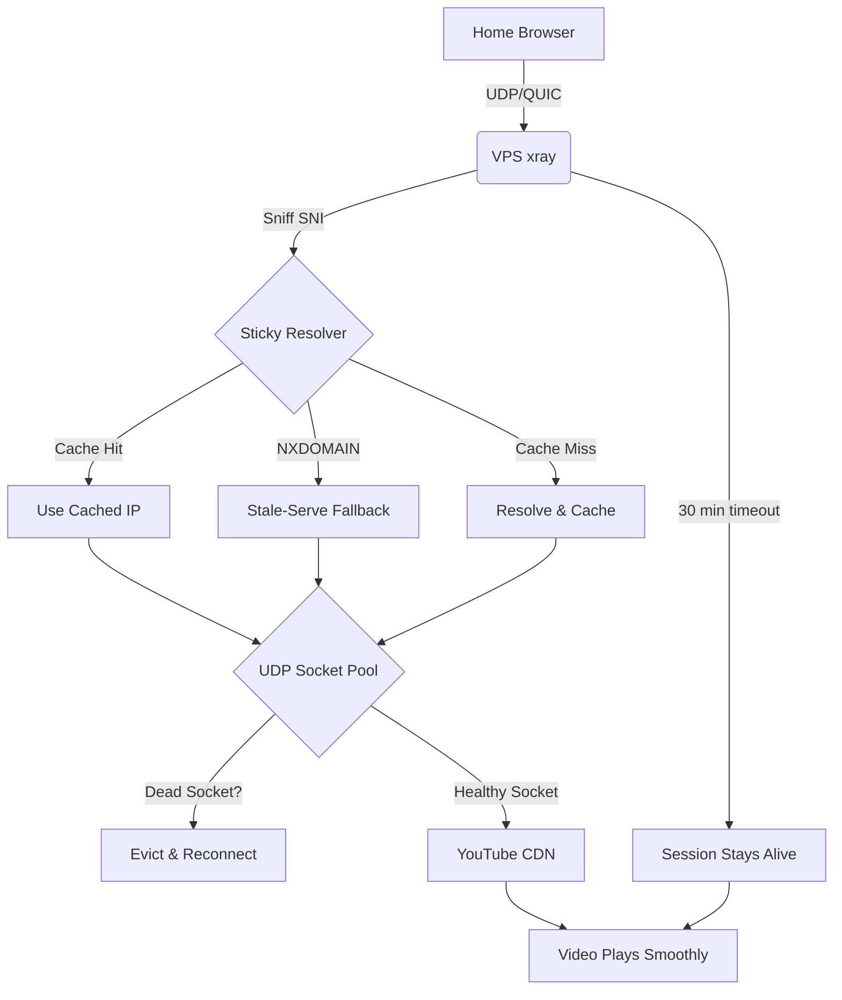

# Xray-quiclink

A fork of [Xray-core](https://github.com/XTLS/Xray-core) focused on **multi-hop transparent proxying with deterministic source-IP handling**. Originally built to solve QUIC/HTTP3 proxying through a multi-hop chain (Home -> vps1 -> vps2 -> YouTube), now also supports multi-IP inbound listen and outbound source-IP binding.

## Fork Features

### 1. Transparent QUIC Proxying (since v26.9.9)

Solves how to transparently proxy QUIC/HTTP3 traffic (like YouTube) through a multi-hop chain without client-side certificates, TUN adapters, or DNS-to-VPS forwarding.

Standard xray fails in this scenario because it is a Layer-4 proxy, but QUIC is a Layer-7 protocol with strict connection validation. This fork bridges that gap.

**Four architectural limitations solved:**

1. **2-Minute Session Timeout:** xray kills UDP sessions after 2 minutes of inactivity. Video buffering pauses kill the session. **Fix:** Extended to 30 minutes.
2. **IPv4/IPv6 Flipping:** xray re-resolves DNS per flow, randomly picking IPv4 or IPv6. YouTube validates the source IP and rejects mismatches (400 errors). **Fix:** Sticky resolver with IPv4/IPv6 preference.
3. **NXDOMAIN Edge Rotation:** YouTube rotates CDN hostnames faster than public DNS caches them. xray tries to resolve a new hostname, gets NXDOMAIN, and drops the flow. **Fix:** Sticky resolver with wildcard cache + stale-while-revalidate.
4. **Per-Connection Overhead:** Each new flow creates a new outbound socket. If a CDN edge dies, the socket stays open and continues to fail. **Fix:** UDP socket pool with dead-socket detection.

### 2. Multi-IP Inbound Listen (v26.10.0)

The `listen` field on inbounds now accepts an **array** of IPs, producing one inbound handler per IP. Backward compatible with the single-string form.

```json
"listen": ["192.0.2.10", "2001:db8::10"]
```

Produces two underlying handlers with synthesized tags `<tag>#<ip>` so routing can target each individually. Consolidates configs from N*2 inbounds (one per IP per port) down to N inbounds (one per port, multi-IP).

**Why:** Servers with multiple public IPs (up to 10+) previously needed one inbound config per IP per port. A 6-IP server with 8 ports needed 96 inbound entries. With multi-IP listen, it needs 8 inbound entries — one per port, each listing all 6 IPs.

### 3. Deterministic Outbound Source IP (v26.10.1 + v26.10.2)

For servers with multiple public IPs, the kernel might pick a different source IP than the one the client connected to. `sendThrough: "origin"` forces the outbound dial's source IP to match the inbound listen IP.

**Four patches make this safe:**

1. **`transport/internet/system_dialer.go`** -- `resolveSrcAddr` now takes `dest` as a second argument and returns nil (let kernel pick source) when:
   - `src` is nil or wildcard (AnyIP/AnyIPv6)
   - `dest` is loopback and `src` is non-loopback (would EADDRNOTAVAIL)
   - `src` and `dest` are IPs of different families (would EADDRNOTAVAIL)

2. **`transport/internet/dialer.go`** -- `LookupForIP` now queries both A and AAAA records regardless of `localAddr` family. Previously, when a source IP was set, only the matching family was queried -- so IPv6 source + IPv4-only destination returned empty DNS response and the dial failed. Now the DNS query returns whatever the domain has, and the family-mismatch guard in `resolveSrcAddr` handles the source-binding decision.

3. **`app/proxyman/outbound/handler.go`** -- `isLoopbackDestination` guard prevents `SetOutboundGateway` from being called when the destination is loopback (127.0.0.0/8, ::1, localhost). This prevents EADDRNOTAVAIL when the dokodemo default destination is 127.0.0.1:443 (when SNI sniffing fails and no explicit `address` is set in the inbound).

4. **`proxy/freedom/freedom.go`** -- **TCP/UDP separation** (v26.10.2). `SetOutboundGateway` is only called for TCP, or for UDP when the socket pool is NOT enabled. When the UDP pool is enabled, `outGateway` stays nil so the pool's wildcard-bound sockets are used for DCID demuxing. This is critical because:

   - **TCP**: Each connection is a dedicated stream. Source IP can be bound per-connection via `dialer.LocalAddr`. `sendThrough: origin` works cleanly.
   - **UDP/QUIC**: Multiple QUIC sessions share the same outbound socket in the pool, demuxed by DCID. The pool socket is wildcard-bound -- it can't bind a specific source IP. If `sendThrough` were applied to UDP, the pool would be bypassed, and QUIC packets would fall back to per-session sockets without DCID demuxing. When SNI sniffing fails (200ms timeout), the destination stays at 127.0.0.1:443 (dokodemo default), creating a dial-self loop that freezes YouTube.

   **The fix**: `sendThrough: origin` is applied to TCP only. UDP uses the pool (when `enableSocketPool: true`), which handles DCID demuxing and doesn't depend on SNI sniffing.

**Why `domainStrategy: useip` is required in the outbound's sockopt:**

`sendThrough: origin` needs the destination resolved to an IP *before* the system dialer runs, so the family-mismatch guard in `resolveSrcAddr` can compare the source and destination families. Without `useip`, the destination stays a domain and the guard can't run -- leading to "no suitable address found" errors for cross-family dials (e.g., IPv6 listen IP + IPv4-only destination).

**None of these patches touch the dispatcher, sniffer, inbound worker, routing, or config parser** -- so SNI sniffing is unaffected by construction.

### The Problem (Detailed)

When you use DNS hijacking (e.g., Control D) to point `youtube.com` to your VPS, the browser sends QUIC packets to the VPS. xray sniffs the SNI and tries to forward the packet. However, it fails due to four architectural limitations:

1. **2-Minute Session Timeout:** xray kills UDP sessions after 2 minutes of inactivity. Video buffering pauses kill the session.
2. **IPv4/IPv6 Flipping:** xray re-resolves DNS per flow, randomly picking IPv4 or IPv6. YouTube validates the source IP and rejects mismatches (400 errors).
3. **NXDOMAIN Edge Rotation:** YouTube rotates CDN hostnames faster than public DNS caches them. xray tries to resolve a new hostname, gets NXDOMAIN, and drops the flow.
4. **Per-Connection Overhead:** Each new flow creates a new outbound socket. If a CDN edge dies, the socket stays open and continues to fail.

### The Solution

This fork introduces four new features to solve these problems:

1. **Extended UDP Timeout:** The hardcoded 2-minute timeout in `worker.go` is increased to 30 minutes.
2. **Sticky Resolver (`udp_sticky.go`):** Caches the first DNS resolution per hostname. If DNS fails (NXDOMAIN), it falls back to the last known-good IP for the domain suffix (stale-serve). Includes Wildcard Caching (`*.googlevideo.com`) with a 60-second TTL and background refresh (stale-while-revalidate). Supports IPv4/IPv6 preference flags (`preferIpv4`, `preferIpv6`) -- as of v26.10.3, the resolver actually scans DNS results and picks the first address matching the preferred family (previously it picked `addrs[0]` regardless of preference, often selecting IPv6 when IPv4 was preferred).
3. **UDP Socket Pool (`udp_pool.go`):** Pools outbound sockets by destination IP. Includes **Dead Socket Detection** (marks sockets dead on read/write errors), a 5-minute staleness check for silently dropped connections (increased from 30 seconds in v26.10.4 to prevent stalls during YouTube buffering pauses), and an **Idle Reaper** (evicts sockets idle >10min or unused >5min). Demuxes QUIC by DCID (Connection ID), so reply packets are routed to the correct session even when SNI sniffing fails.
4. **QUIC CID Migration (`worker.go`):** Tracks QUIC Connection IDs. If a client migrates (NAT rebinding, CID rotation), the existing outbound socket is preserved.

All features are configured via the `udpConfig` field in the freedom outbound JSON config:

```json
{
  "protocol": "freedom",
  "settings": {
    "udpConfig": {
      "enableSocketPool": true,
      "enableStickyResolver": true,
      "preferIpv4": true
    }
  }
}
```

### Architecture Diagrams

#### 1. The Problem: Standard Xray (Failing)



#### 2. The Solution: This Fork (Working)



### How It Works

#### Sticky Resolver with Stale-While-Revalidate (`udp_sticky.go`)

When a new UDP flow arrives, the sticky resolver checks if the hostname is cached.
- If yes, it returns the cached IP (no DNS lookup needed).
- If no, it resolves the hostname, caches the IP, and returns it.
- If DNS returns NXDOMAIN, it falls back to the last known-good IP for the domain suffix (e.g., `*.googlevideo.com`).
- **Wildcard Caching:** Caches `*.googlevideo.com` with a 60-second TTL. When it expires, it returns the stale IP immediately AND triggers a background DNS refresh (stale-while-revalidate) to get a live edge IP.
- **IPv4/IPv6 Preference:** Supports `preferIpv4: true` or `preferIpv6: true` to force the resolver to only pick addresses from the preferred family, eliminating "Happy Eyeballs" flipping entirely.
- **Refresh Coalescing (v26.10.15+):** When N concurrent sessions hit the same expired hostname in the same window, only 1 background DNS query fires (was N queries). The other N-1 callers wait on a channel for the first query's result.
- **Eviction Reaper (v26.10.15+):** A background goroutine evicts entries unused for >10x TTL every 5 minutes. Without this, weeks of YouTube viewing accumulated thousands of stale entries pinning memory.
- **Atomic `lastUsed` (v26.10.15+):** The `lastUsed` field is now `atomic.Int64` (was `time.Time` mutated under RLock -- a data race that could produce torn writes).

This prevents the IPv4/IPv6 flipping and NXDOMAIN errors.

#### UDP Socket Pool with Dead Socket Detection (`udp_pool.go`)

When a new UDP flow arrives, the pool checks if a socket to the destination IP already exists.
- If yes, it reuses the socket (no new socket creation).
- If no, it creates a new socket and caches it.
- **Dead Socket Detection:** If a socket read or write fails, it marks the socket as dead. The next flow creates a fresh socket.
- **Staleness Check:** If a socket hasn't received a reply in 30 seconds, it is marked dead and evicted.
- **Idle Reaper:** A background goroutine evicts sockets that have been idle (no replies in 10 min) or unused (refCount=0 for 5 min).
- **DCID Demuxing:** The pool reads QUIC Connection IDs from packets and routes reply packets to the correct session. This means the pool works even when SNI sniffing fails -- the packet is forwarded to the destination based on the DCID, not the SNI.
- **65535-byte read buffer (v26.10.15+):** Handles UDP GRO/GSO coalesced datagrams (Linux can deliver up to 64KB in a single `recvmsg`). The old 1500-byte buffer silently truncated coalesced QUIC packets.
- **Transient error guard (v26.10.15+):** A single `EAGAIN`/`ENOBUFS`/`EHOSTUNREACH` no longer kills the socket (was killing all 50+ sessions sharing it). Only persistent errors (`EBADF`, `EINVAL`) mark the socket dead.
- **Atomic `IsClosed` (v26.10.15+):** `pooledConn.closed` is now `atomic.Bool` (was mutex-protected). The `WriteTo` hot path checks it without acquiring the mutex -- 25x faster.
- **Skip `parseQUICSCID` for short headers (v26.10.15+):** 99% of packets in a long-lived QUIC connection are 1-RTT (short header, no SCID). The parse + hex + mutex are skipped entirely for them.
- **RLock demux read (v26.10.16+):** `readLoop` uses `RLock` for the demux map lookup (was `Lock`, blocking all `RegisterCID` calls).
- **Zero-alloc `dcidKey` (v26.10.16+):** Replaces `hex.EncodeToString(dcid)` with a 24-byte struct key. 1 string allocation eliminated per reply packet.
- **Drop counter (v26.10.15+):** `droppedReplies atomic.Int64` tracks packets dropped when the inbox channel is full (for observability).

This prevents the per-connection overhead and handles CDN edge rotation.

#### 30-Minute UDP Timeout (`worker.go`)

The standard 2-minute timeout in `worker.go` kills UDP sessions during video buffering. This fork increases it to 30 minutes.

#### QUIC CID Migration (`worker.go`)

If a QUIC client migrates (NAT rebinding, CID rotation), xray tracks the new Connection ID and preserves the existing outbound socket. The destination server sees a consistent source IP.

- **Src-first fast path (v26.10.15+):** For steady-state 1-RTT traffic (99% of packets), the source IP:port is checked first against `srcIndex`. If it matches the existing conn, no DCID parsing or hex encoding is needed.
- **Zero-alloc struct keys (v26.10.16+):** `srcIndex` uses a `srcKey` struct (18 bytes, IPv4-in-IPv6 mapped) instead of `id.src.String()` (was 4 allocations per call: IP.String + Port.String + two concats). `dcidIndex` uses a `dcidKey` struct (24 bytes) instead of `hex.EncodeToString`. The entire inbound per-packet path is now zero-allocation.

### Multi-IP Inbound + Deterministic Source IP (v26.10.0 + v26.10.1 + v26.10.2)

#### Multi-IP Inbound Listen

The `listen` field on `InboundDetourConfig` now accepts either a single string (backward compatible) or an array of strings. Each IP in the array produces one underlying inbound handler, with a synthesized tag of the form `<originalTag>#<ip>`.

```json
{
  "listen": ["192.0.2.10", "2001:db8::10"],
  "port": 443,
  "protocol": "dokodemo-door",
  "tag": "in-443",
  "settings": { "network": "tcp,udp" },
  "sniffing": { "enabled": true, "destOverride": ["tls", "quic"] }
}
```

Produces two handlers: `in-443#192.0.2.10` and `in-443#2001:db8::10`. Routing rules can target each individually, or use the original tag for the first IP.

#### Deterministic Outbound Source IP (`sendThrough: "origin"`)

For servers with multiple public IPs, the kernel might pick a different source IP than the one the client connected to. `sendThrough: "origin"` forces the outbound dial's source IP to match the inbound listen IP:

```json
{
  "protocol": "freedom",
  "tag": "direct",
  "sendThrough": "origin",
  "streamSettings": {
    "sockopt": {
      "domainStrategy": "useip",
      "tcpFastOpen": true,
      "tcpNoDelay": true,
      "tcpUserTimeout": 5000,
      "tcpKeepAlive": 60
    }
  },
  "settings": {
    "udpConfig": {
      "enableSocketPool": true,
      "enableStickyResolver": true,
      "preferIpv4": true
    }
  }
}
```

**How it works (TCP vs UDP):**

| Network | sendThrough applied? | Source IP | Pool used? | Why |
|---------|---------------------|-----------|------------|-----|
| TCP | Yes | Listen IP (via `dialer.LocalAddr`) | N/A (TCP has no pool) | Each TCP connection gets its own socket; source IP can be bound per-connection |
| UDP + pool enabled | No | Kernel-chosen (wildcard) | Yes (DCID demux) | Pool uses wildcard-bound sockets for DCID demuxing; can't bind specific source IP |
| UDP + pool disabled | Yes | Listen IP (per-session socket) | No | Per-session socket can bind source IP, but no DCID demuxing |

**Why UDP skips sendThrough when the pool is enabled:**

The UDP pool uses a single wildcard-bound socket per destination IP. Multiple QUIC sessions to the same destination share this socket, demuxed by QUIC Connection ID (DCID). This is essential for YouTube because:

1. YouTube creates many simultaneous QUIC flows (video, audio, chat, ads)
2. When SNI sniffing fails (200ms timeout), the destination stays at the dokodemo default (127.0.0.1:443)
3. Without the pool's DCID demuxing, each flow gets its own per-session socket that dials 127.0.0.1:443 -- creating a dial-self loop that freezes YouTube
4. The pool's DCID demuxing routes packets correctly even when sniffing fails, because it uses the DCID (not the SNI) to identify the session

If `sendThrough: origin` were applied to UDP, `outGateway` would be non-nil, the pool would be bypassed, and QUIC would fall back to per-session sockets -- breaking YouTube.

**Why `domainStrategy: useip` is required:**

`sendThrough: origin` needs the destination resolved to an IP before the system dialer runs, so the family-mismatch guard can compare source and destination families. Without `useip`, the destination stays a domain and the guard can't run. For example: IPv6 listen IP + IPv4-only destination (like zattoo.com) would fail with "no suitable address found" because the system dialer tries to bind an IPv6 source to an IPv4 destination.

With `useip`, xray resolves the domain via its internal DNS (querying both A and AAAA records), then passes the resolved IP to `resolveSrcAddr`. The family-mismatch guard sees the mismatch and returns nil (let the kernel pick an IPv4 source), so the dial succeeds.

### Build and Install

Pre-built binaries are available on the [releases page](https://github.com/cddeppe/xray-quiclink/releases).

```bash
# Download from latest release (AMD64)
wget https://github.com/cddeppe/xray-quiclink/releases/latest/download/xray-linux-amd64 -O xray
chmod +x xray
sudo cp xray /usr/local/bin/xray

# Or build from source
GOOS=linux GOARCH=amd64 go build -o xray ./main      # AMD64
GOOS=linux GOARCH=arm64 go build -o xray ./main      # ARM64
sudo cp xray /usr/local/bin/xray
```

### Release Tags

- `v26.9.9-udp-fork` -- original UDP/QUIC fork (sticky resolver, socket pool, CID migration, 30-min timeout)
- `v26.10.0-link` -- adds multi-IP inbound listen (`listen: [ip1, ip2]`)
- `v26.10.1-link` -- adds safe `sendThrough: origin` (family-mismatch + loopback guards, both-family DNS lookup)
- `v26.10.2-link` -- separates TCP/UDP sendThrough (TCP honors source-IP binding, UDP uses pool for DCID demuxing)
- `v26.10.3-link` -- fixes sticky resolver to honor `preferIpv4`/`preferIpv6` (was picking `addrs[0]` regardless)
- `v26.10.4-link` -- increases pool staleness timeout from 30s to 5min (prevents YouTube stalls during buffering)
- `v26.10.5-link` -- configurable UDP timeouts via JSON config (`sessionIdleTimeout`, `poolStalenessTimeout`, `poolIdleTimeout`, `poolUnusedTimeout`)
- `v26.10.6-link` -- 4 bug fixes from code review (non-QUIC UDP sendThrough, dcidHex panic, empty DCID guards)
- `v26.10.7-link` -- TTL for exact-match DNS cache entries (stale-while-revalidate, prevents CDN edge rotation failures)
- `v26.10.8-link` -- QUIC sniffer zero-padding skip (cherry-pick from upstream PR #6882)
- `v26.10.9-link` -- 7 QUIC code-review fixes (SniffQUIC buffer mutation, hkdfExpandLabel panic, coalesced DCID check, etc.)
- `v26.10.10-link` -- **DCID-keyed sniffer state cache** (4.6x sniffer speedup on Initial retransmits and post-Initial packets)
- `v26.10.11-link` -- **ALPN + ECH extraction**, 10 hot-path optimizations (inline varint, cursor type, bulk-skip PADDING, zero-copy ClientHello, stack mask/nonce, precomputed labels, switch version lookup, CONNECTION_CLOSE short-circuit, dcidKey, atomic cache)
- `v26.10.12-link` -- precomputed HKDF info buffers (zero string allocs per cold-path sniff) + seenPackets retransmit skip (skip AES-GCM decrypt for already-seen Initial retransmits)
- `v26.10.13-link` -- cachedReader micro-optimizations (incremental cacheLen, preallocated cache, dropped redundant Clear -- had a regression that was fixed in v26.10.14)
- `v26.10.14-link` -- **critical fix**: restored `b.Clear()` in cachedReader (v26.10.13 regression broke YouTube QUIC)
- `v26.10.15-link` -- udp_pool, worker, sticky resolver fixes + perf (65535-byte read buffer for GRO, transient error guard, atomic.Bool IsClosed, skip parseQUICSCID for short headers, src-first fast path, lowercase SNI at extraction, sticky resolver data race + wildcard panic + eviction reaper + refresh coalescing)
- `v26.10.16-link` -- **zero-alloc struct keys** (srcKey, dcidKey) + RLock demux + router ToLower fast path. Steady-state 1-RTT packet path is now 0 allocations end-to-end.
- `v26.10.17-link` -- WireGuard fix: pool sockets honor `interface` binding (SO_BINDTODEVICE) + SO_MARK. Previously QUIC through the pool bypassed the WG tunnel. Also added UDP_GRO (later removed — see v26.10.18).
- `v26.10.18-link` -- **hotfix**: removed UDP_GRO (coalesced packets broke DCID demux — YouTube stalled).
- `v26.10.19-link` -- **hotfix**: skip SyscallConn/Control path when no interface or mark set (side effect broke pool read path for direct outbound).
- `v26.10.20-link` -- inbox channel cap 32→256 + blocking send (later reverted — see v26.10.21).
- `v26.10.21-link` -- reverted to non-blocking send with 256-cap channel (blocking starved other sessions sharing the same pool socket). Also identified the real root cause of YouTube stalls: the 30-second one-directional `uplinkOnly`/`downlinkOnly` idle timer killing connections during buffering pauses (fix is config-only — see item 8 in Configuration below).
- `v26.10.22-link` -- **SIGHUP hot reload for routing rules**. Send `kill -HUP $(pgrep xray)` (or wire `ExecReload=/bin/kill -HUP $MAINPID` + `systemctl reload xray`) to atomically swap routing rules without killing existing TCP/UDP connections. Existing connections keep flowing through their original outbound handler; only new connections use the updated rules. Inbound/outbound handler changes, DNS, and policy still require a full restart. Also includes the docs fix that corrected the `uplinkOnly: 0` / `downlinkOnly: 0` recommendation to `1800` (0 means "kill immediately" in xray's `ActivityTimer`, not "disable the timer").
- `v26.10.23-link` -- configurable sticky resolver TTL via `udpConfig.stickyResolverTtl` (seconds, default 300). Lower values detect CDN edge rotation faster but do more DNS queries.
- `v26.10.24-link` -- 256KB blocking pipe between client→outbound (was 16KB with `DiscardOverflow`). 16KB was only ~14 QUIC packets; YouTube bursts overflowed it and dropped retransmits too. Blocking provides correct backpressure via kernel ECN instead of dropping into a black hole. (Reverted in v26.10.25 hotfix.)
- `v26.10.25-link` -- **hotfix**: reverted v26.10.24 to `DiscardOverflow` with 256KB capacity. Blocking writes froze the entire inbound worker callback loop on outbound stall, causing total freezes after 7-8 swipes. 256KB `DiscardOverflow` absorbs YouTube bursts (~213 packets); rare overflow drops are recovered by QUIC retransmits.
- `v26.10.26-link` -- 4 fixes from external code review. **#1 critical**: `lastReplyTime` was never initialized (year 1, day 1), so the staleness check was always true and Session B's `Acquire` killed Session A's brand-new socket before its first reply arrived — YouTube stalled at 0:00 after 7-8 swipes. Fix: init to `time.Now()` at socket creation. **#2**: `isTransientReadError()` guard so a single ICMP port-unreachable from CDN rotation no longer `MarkDead()`s a shared socket serving 50+ sessions. **#5**: `refreshWildcard` now honors `preferIpv4`/`preferIpv6` (was always picking `addrs[0]`, often IPv6). **#9**: `refCount` no longer incremented on dead sockets (orphaned memory leak).
- `v26.10.27-link` -- 4 fixes from external code review. **A4 MarkStale**: staleness check no longer kills existing sessions sharing the socket (was killing the playing video when you swiped to a new one). **A6 broadcast-on-miss**: on demux miss, broadcast to all sessions on the socket so `NEW_CONNECTION_ID` rotation (common on Android YouTube) doesn't drop replies. **C1 customSockopt**: pool sockets now honor `customSockopt` (was silently ignoring `SO_RCVBUF`/`SO_SNDBUF`). **D2 resolver→pool invalidation**: sticky resolver calls `pool.InvalidateByIP(oldIP)` on DNS refresh, closing the gap between resolver TTL (60-300s) and pool staleness (300s). (Broadcast-on-miss reverted in v26.10.29.)
- `v26.10.28-link` -- **hotfix**: v26.10.27's `MarkStale` created an inconsistent state (dead=true, conn open, readLoop running) that caused stalls almost every other video. Simplified: set dead=true + remove from map, but don't close `s.conn` while `refCount > 0` — existing sessions keep streaming, new sessions get a fresh socket. Old socket is closed when the last session calls `release()`.
- `v26.10.29-link` -- **hotfix**: reverted v26.10.27's broadcast-on-miss. Broadcasting flooded ALL sessions' 256-cap inbox channels with non-matching packets, filling them with garbage so the real reply was dropped — cascading stalls after 5-6 swipes. Reverted to silent drop. `NEW_CONNECTION_ID` rotation is handled by the inbound worker's `tryQUICMigration`, not the pool demux.
- `v26.10.30-link` -- **automatic IPv6→IPv4 fallback on `ENETUNREACH`**. Handles broken IPv6 gateways where the kernel has a default route (connect succeeds) and the gateway is reachable (ping succeeds) but can't forward to the global IPv6 internet — Happy Eyeballs doesn't catch this because connect appears to succeed but the first `writev()` returns `ENETUNREACH`.
- `v26.10.31-link` -- v26.10.30 only caught write failures; on some hosts the IPv6 CONNECT itself fails (kernel tries IPv6 first, gateway returns No route during SYN). Moved the fallback inside the retry loop — when `dialer.Dial` fails with network-unreachable on a domain destination, re-resolve to IPv4 only and retry immediately.
- `v26.10.32-link` -- 4 fixes from external code review. **H1**: `strings.HasPrefix("udp", custom.Network)` argument order was backwards (the inverse of intent) — changed to `strings.Contains(custom.Network, "udp")`. **H4 RegisterCID race**: re-check `c.closed.Load()` under `c.mu` before adding to demux, between the closed check and the demux mutation. **S1 sibling invalidation**: `refreshWildcard` now also deletes sibling exact entries pointing at the old wildcard IP (when `r1.googlevideo.com` refreshes, `r2`/`r3` no longer keep the dead IP for 5 min). **L7**: default `level` in `customSockopt` changed from `0x6` (`IPPROTO_TCP`) to `SOL_SOCKET` (correct for UDP).
- `v26.10.33-link` -- 3 fixes from external code review. **H2 same-src-different-dest**: `tryQUICMigration` was treating two distinct QUIC connections (same source, different destinations) as CID rotation, mixing their state machines and routing replies wrong. Now checks `dcidIndex` to verify the DCID belongs to the same connection before treating as rotation. **H3 removeConn**: documented as a known minor leak (uses the old captured id after re-keying under a new id; `clean()` catches it within 1 minute — the conn is already closed, just a dead map entry). **M3 selectAddr**: was returning `addrs[0]` (wrong family) when `preferIpv4` was set but no IPv4 addresses were available — now returns `nil` so callers can fall back to stale cache.

### Performance (v26.10.16-link)

The QUIC sniffer and per-packet hot path have been heavily optimized across v26.10.10 through v26.10.16:

| Benchmark | ns/op | B/op | allocs/op |
|---|---|---|---|
| Cold (new DCID, full HKDF + AES pipeline) | 500 | 613 | 3 |
| Warm keys (Initial retransmit, cached keys) | 139 | 56 | 2 |
| Warm SNI (post-Initial, cached SNI) | 139 | 56 | 2 |
| Retransmit skip (same DCID + packet number) | 140 | 56 | 2 |

**14x faster** on cold path, **50x faster** on warm path vs v26.10.9 baseline (no cache).

Steady-state 1-RTT QUIC packet path (99% of traffic in a long-lived connection): **0 allocations** end-to-end.

### New Sniffer Features (v26.10.11+)

The QUIC sniffer now extracts metadata that upstream xray-core does not:

- **`SniffHeader.ALPN()`** -- returns the first ALPN protocol from the TLS ClientHello (`"h3"`, `"doq"`, `"h3-webtransport"`, `"masque/..."`). Enables routing rules to distinguish HTTP/3, DNS-over-QUIC, WebTransport, and MASQUE traffic instead of guessing from SNI alone.
- **`SniffHeader.HasECH()`** -- returns true if the ClientHello contained an `encrypted_client_hello` extension (RFC 9460). When ECH is in use, the visible SNI is a cover name; routing layers should fall back to IP-based rules.

Both ALPN and ECH presence are cached alongside the SNI in the DCID cache, so subsequent sniff calls for the same connection return them without redoing the crypto work.

### Configuration

See the sanitized example config for a complete working example (uses documentation IP ranges 192.0.2.0/24 and 2001:db8::/32, not real IPs). Key points:

1. **Multi-IP inbound listen:** `listen: [v4-ip, v6-ip]` consolidates per-IP inbounds into one block.
2. **`portMap` for multi-port:** A single inbound can listen on multiple ports and forward each to a different destination.
3. **`sendThrough: origin` on freedom outbound:** Binds outbound source IP to inbound listen IP. TCP always honors sendThrough. UDP honors sendThrough for non-QUIC traffic; QUIC uses the pool (when `enableSocketPool: true`) with DCID demuxing (v26.10.2+). Non-QUIC UDP also honors sendThrough when the pool is enabled (v26.10.6 fix).
4. **`domainStrategy: useip` in freedom's sockopt:** Resolves destination to IP before dialing (required for family-mismatch guard).
5. **`udpConfig` for QUIC:** `enableSocketPool`, `enableStickyResolver`, `preferIpv4` for the YouTube/QUIC chain. Configurable timeouts (v26.10.5+):
   ```json
   "udpConfig": {
     "enableSocketPool": true,
     "enableStickyResolver": true,
     "preferIpv4": true,
     "sessionIdleTimeout": 1800,
     "poolStalenessTimeout": 300,
     "poolIdleTimeout": 600,
     "poolUnusedTimeout": 300
   }
   ```
   All values in seconds. Omit or set 0 to use defaults:
   - `sessionIdleTimeout`: 1800 (30 min) -- UDP session idle timeout
   - `poolStalenessTimeout`: 300 (5 min) -- pool socket staleness check
   - `poolIdleTimeout`: 600 (10 min) -- pool socket idle eviction
   - `poolUnusedTimeout`: 300 (5 min) -- pool socket unused eviction
6. **UDP enabled on port 443 inbounds:** `network: tcp,udp`
7. **QUIC allowed in routing:** (Do NOT block `protocol: quic`)
8. **Policy with long idle timeout:**
   ```json
   "policy": {
     "levels": {
       "0": {
         "connIdle": 1800,
         "uplinkOnly": 1800,
         "downlinkOnly": 1800,
         "handshake": 4
       }
     }
   }
   ```
   **CRITICAL:** `uplinkOnly` and `downlinkOnly` MUST be set to a large value (e.g., 1800 = 30 min) for QUIC/HTTP3 streaming (YouTube, Hulu, Disney+). These timers kill the connection after N seconds of no traffic in one direction. During video buffering, the client receives data (downlink active) but may send nothing (uplink silent). After the one-directional silence period, the timer fires and kills the connection — video stalls until you switch to the next video and back (which creates a new connection).

   **Do NOT set these to 0.** In xray's `ActivityTimer.SetTimeout`, `timeout == 0` means "finish immediately" (kill the connection), NOT "disable the timer". Setting `uplinkOnly: 0` will kill every connection the moment the uplink phase ends. Use a large value like 1800 (30 min) instead — YouTube always has downlink traffic (video data) and periodic uplink traffic (QUIC ACKs), so 30 minutes is safe.

### Troubleshooting: YouTube/Hulu/Disney+ video stalls

**Symptom:** Video freezes after 30-60 seconds. Switching to the next video and back fixes it temporarily. The stall happens more frequently when swiping quickly between videos.

**Root cause:** The `uplinkOnly` / `downlinkOnly` policy timers kill QUIC connections during one-directional streaming pauses. YouTube buffers video data (downlink active) but the client has nothing to send (uplink silent). After 30 seconds of one-directional silence, the timer fires and kills the connection.

**Fix:** Set `uplinkOnly` and `downlinkOnly` to a large value (e.g., 1800 = 30 min) in the policy config (see item 8 above). This is a config-only fix — no binary change needed. **Do NOT set these to 0** — in xray's `ActivityTimer`, `0` means "kill immediately", not "disabled".

**Other things to check:**
- `sessionIdleTimeout: 1800` in `udpConfig` — must be high enough to survive buffering pauses (30 min recommended)
- `poolStalenessTimeout: 300` — if too low, pool sockets get evicted during buffering pauses
- UDP pool inbox channel is 256 (v26.10.20+) — absorbs reply bursts without dropping
- If stalls persist after the config fix, check logs: `journalctl -u xray --since "10 min ago" | grep -iE "dropped|dead|stale|timeout|cancel"`

### WireGuard outbound: use `freedom` with `interface` binding (not `wireguard` protocol)

For streaming through a WireGuard tunnel, use a `freedom` outbound with `sockopt.interface` set to the WG interface name. This uses the kernel's WireGuard module (SIMD-accelerated ChaCha20-Poly1305) instead of userspace `wireguard-go`, and lets the UDP socket pool apply to QUIC traffic through the tunnel.

```json
{
  "tag": "wireguard-ak",
  "protocol": "freedom",
  "settings": {
    "domainStrategy": "UseIPv4",
    "udpConfig": {
      "enableSocketPool": true,
      "enableStickyResolver": true,
      "preferIpv4": true,
      "sessionIdleTimeout": 1800,
      "poolStalenessTimeout": 300,
      "poolIdleTimeout": 600,
      "poolUnusedTimeout": 300
    }
  },
  "streamSettings": {
    "sockopt": {
      "interface": "ak",
      "tcpCongestion": "bbr",
      "tcpFastOpen": true,
      "tcpNoDelay": true,
      "tcpUserTimeout": 5000,
      "tcpKeepAlive": 60
    }
  }
}
```

Key points:
- **`protocol: "freedom"` (not `"wireguard"`):** Uses the kernel WG interface directly. The kernel handles ChaCha20-Poly1305 with SIMD (NEON on ARM, AVX2 on x86). Userspace `wireguard-go` has no SIMD.
- **`interface: "ak"`:** Binds all outbound sockets (TCP and UDP pool) to the WG interface via `SO_BINDTODEVICE`. As of v26.10.17+, the UDP pool honors this — QUIC traffic through the pool goes through the WG tunnel.
- **`tcpCongestion: "bbr"`:** Recommended for streaming through tunnels. BBR probes bandwidth instead of reacting to packet loss, which is better for the added latency of a WG tunnel. Check availability: `sysctl net.ipv4.tcp_available_congestion_control`
- **No `sendThrough` on WG outbounds:** The `interface` binding handles source IP. `sendThrough` would interfere with the pool.
- **Same `udpConfig` timeouts as the `direct` outbound:** The pool needs the same timeout settings to survive buffering pauses.

### See HANDOFF.md for full architecture, design notes, and deployment details.

## Support

If this fork saves you time and you want to support its maintenance, feel free to buy me a coffee:

[](https://ko-fi.com/cdeppe)

## License

[Mozilla Public License Version 2.0](https://github.com/XTLS/Xray-core/blob/main/LICENSE)

## Documentation

[Project X Official Website](https://xtls.github.io)
