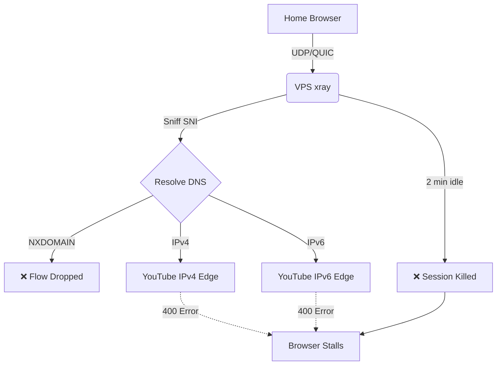
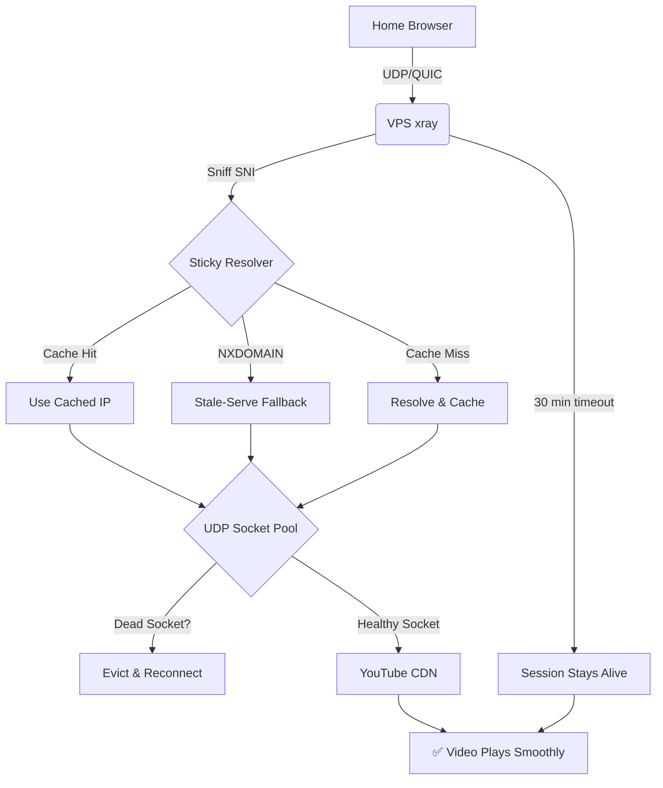

# xray-link

A fork of [Xray-core](https://github.com/XTLS/Xray-core) focused on **multi-hop transparent proxying with deterministic source-IP handling**. Originally built to solve QUIC/HTTP3 proxying through a multi-hop chain (Home -> vps-de -> vps-al -> YouTube), now also supports multi-IP inbound listen and outbound source-IP binding.

## Fork Features

### 1. Transparent QUIC Proxying (since v26.9.9)

Solves how to transparently proxy QUIC/HTTP3 traffic (like YouTube) through a multi-hop chain without client-side certificates, TUN adapters, or DNS-to-VPS forwarding.

Standard xray fails in this scenario because it is a Layer-4 proxy, but QUIC is a Layer-7 protocol with strict connection validation. This fork bridges that gap.

### 2. Multi-IP Inbound Listen (v26.10.0)

The `listen` field on inbounds now accepts an **array** of IPs, producing one inbound handler per IP. Backward compatible with the single-string form.

```json
"listen": ["192.0.2.10", "2001:db8::10"]
```

Produces two underlying handlers with synthesized tags `<tag>#<ip>` so routing can target each individually. Consolidates configs from N*2 inbounds (one per IP per port) down to N inbounds (one per port, multi-IP).

### 3. Deterministic Outbound Source IP (v26.10.1)

For servers with multiple public IPs, `sendThrough: origin` on the freedom outbound binds the outbound dial's source IP to the inbound listen IP. Combined with three small patches:

- `resolveSrcAddr` (system_dialer.go): skips source binding when destination is loopback or source/dest IP families mismatch (avoids EADDRNOTAVAIL)
- `LookupForIP` (dialer.go): queries both A and AAAA DNS records regardless of source IP family (so IPv4-only domains resolve even with IPv6 source)
- UDP pool bypass (freedom.go): bypasses the socket pool when sendThrough is configured, so QUIC honors the source IP

This makes `sendThrough: origin` safe to use universally -- it kicks in when families match, and lets the kernel pick when they don't.

### The Problem

When you use DNS hijacking (e.g., Control D) to point `youtube.com` to your VPS, the browser sends QUIC packets to the VPS. xray sniffs the SNI and tries to forward the packet. However, it fails due to four architectural limitations:

1. **2-Minute Session Timeout:** xray kills UDP sessions after 2 minutes of inactivity. Video buffering pauses kill the session.
2. **IPv4/IPv6 Flipping:** xray re-resolves DNS per flow, randomly picking IPv4 or IPv6. YouTube validates the source IP and rejects mismatches (400 errors).
3. **NXDOMAIN Edge Rotation:** YouTube rotates CDN hostnames faster than public DNS caches them. xray tries to resolve a new hostname, gets NXDOMAIN, and drops the flow.
4. **Per-Connection Overhead:** Each new flow creates a new outbound socket. If a CDN edge dies, the socket stays open and continues to fail.

### The Solution

This fork introduces four new features to solve these problems:

1. **Extended UDP Timeout:** The hardcoded 2-minute timeout in `worker.go` is increased to 30 minutes.
2. **Sticky Resolver (`udp_sticky.go`):** Caches the first DNS resolution per hostname. If DNS fails (NXDOMAIN), it falls back to the last known-good IP for the domain suffix (stale-serve). Includes Wildcard Caching (`*.googlevideo.com`) with a 60-second TTL and background refresh (stale-while-revalidate). Supports IPv4/IPv6 preference flags.
3. **UDP Socket Pool (`udp_pool.go`):** Pools outbound sockets by destination IP. Includes **Dead Socket Detection** (marks sockets dead on read/write errors), a 30-second staleness check for silently dropped connections, and an **Idle Reaper** (evicts sockets idle >10min or unused >5min).
4. **QUIC CID Migration (`worker.go`):** Tracks QUIC Connection IDs. If a client migrates (NAT rebinding, CID rotation), the existing outbound socket is preserved.

All features are configured via the `udpConfig` field in the freedom outbound JSON config:

```json
{
  "protocol": "freedom",
  "settings": {
    "udpConfig": {
      "enableSocketPool": true,
      "enableStickyResolver": true,
      "preferIpv4": true
    }
  }
}
```

### Architecture Diagrams

#### 1. The Problem: Standard Xray (Failing)



#### 2. The Solution: This Fork (Working)



### How It Works

#### Sticky Resolver with Stale-While-Revalidate (`udp_sticky.go`)

When a new UDP flow arrives, the sticky resolver checks if the hostname is cached.
- If yes, it returns the cached IP (no DNS lookup needed).
- If no, it resolves the hostname, caches the IP, and returns it.
- If DNS returns NXDOMAIN, it falls back to the last known-good IP for the domain suffix (e.g., `*.googlevideo.com`).
- **Wildcard Caching:** Caches `*.googlevideo.com` with a 60-second TTL. When it expires, it returns the stale IP immediately AND triggers a background DNS refresh (stale-while-revalidate) to get a live edge IP.
- **IPv4/IPv6 Preference:** Supports `XRAY_UDP_PREFER_IPV4=1` or `XRAY_UDP_PREFER_IPV6=1` to force the resolver to only pick addresses from the preferred family, eliminating "Happy Eyeballs" flipping entirely.

This prevents the IPv4/IPv6 flipping and NXDOMAIN errors.

#### UDP Socket Pool with Dead Socket Detection (`udp_pool.go`)

When a new UDP flow arrives, the pool checks if a socket to the destination IP already exists.
- If yes, it reuses the socket (no new socket creation).
- If no, it creates a new socket and caches it.
- **Dead Socket Detection:** If a socket read or write fails, it marks the socket as dead. The next flow creates a fresh socket.
- **Staleness Check:** If a socket hasn't received a reply in 30 seconds, it is marked dead and evicted.
- **Idle Reaper:** A background goroutine evicts sockets that have been idle (no replies in 10 min) or unused (refCount=0 for 5 min).

This prevents the per-connection overhead and handles CDN edge rotation.

#### 30-Minute UDP Timeout (`worker.go`)

The standard 2-minute timeout in `worker.go` kills UDP sessions during video buffering. This fork increases it to 30 minutes.

#### QUIC CID Migration (`worker.go`)

If a QUIC client migrates (NAT rebinding, CID rotation), xray tracks the new Connection ID and preserves the existing outbound socket. The destination server sees a consistent source IP.

### Multi-IP Inbound + Deterministic Source IP (v26.10.0 + v26.10.1)

#### Multi-IP Inbound Listen

The `listen` field on `InboundDetourConfig` now accepts either a single string (backward compatible) or an array of strings. Each IP in the array produces one underlying inbound handler, with a synthesized tag of the form `<originalTag>#<ip>`.

```json
{
  "listen": ["192.0.2.10", "2001:db8::10"],
  "port": 443,
  "protocol": "dokodemo-door",
  "tag": "in-443",
  "settings": { "network": "tcp,udp" },
  "sniffing": { "enabled": true, "destOverride": ["tls", "quic"] }
}
```

Produces two handlers: `in-443#192.0.2.10` and `in-443#2001:db8::10`. Routing rules can target each individually, or use the original tag for the first IP.

#### Deterministic Outbound Source IP (`sendThrough: "origin"`)

For servers with multiple public IPs, the kernel might pick a different source IP than the one the client connected to. `sendThrough: "origin"` forces the outbound dial's source IP to match the inbound listen IP:

```json
{
  "protocol": "freedom",
  "tag": "direct",
  "sendThrough": "origin",
  "streamSettings": {
    "sockopt": {
      "domainStrategy": "useip",
      "tcpFastOpen": true,
      "tcpNoDelay": true,
      "tcpUserTimeout": 5000,
      "tcpKeepAlive": 60
    }
  },
  "settings": {
    "udpConfig": {
      "enableSocketPool": true,
      "enableStickyResolver": true,
      "preferIpv4": true
    }
  }
}
```

Three patches make this safe:

1. `transport/internet/system_dialer.go` -- `resolveSrcAddr` now takes `dest` as a second argument and returns nil (let kernel pick source) when dest is loopback or source/dest families mismatch.
2. `transport/internet/dialer.go` -- `LookupForIP` now queries both A and AAAA records regardless of `localAddr` family. Previously, IPv6 source + IPv4-only destination returned empty DNS response.
3. `proxy/freedom/freedom.go` -- bypass the UDP socket pool when `outGateway` is non-nil (sendThrough configured), so QUIC honors the source IP.

`domainStrategy: useip` in the outbound's sockopt is required: it resolves the destination to an IP before the system dialer runs, so the family-mismatch guard can compare source and destination families.

None of these patches touch the dispatcher, sniffer, inbound worker, routing, or config parser -- so SNI sniffing is unaffected by construction.

### Build and Install

Pre-built binaries are available on the [releases page](https://github.com/cddeppe/Xray-link/releases).

```bash
# Download from latest release (AMD64)
wget https://github.com/cddeppe/Xray-link/releases/latest/download/xray-linux-amd64 -O xray
chmod +x xray
sudo cp xray /usr/local/bin/xray

# Or build from source
GOOS=linux GOARCH=amd64 go build -o xray ./main      # AMD64
GOOS=linux GOARCH=arm64 go build -o xray ./main      # ARM64
sudo cp xray /usr/local/bin/xray
```

### Release Tags

- `v26.9.9-udp-fork` -- original UDP/QUIC fork (sticky resolver, socket pool, CID migration, 30-min timeout)
- `v26.10.0-link` -- adds multi-IP inbound listen (`listen: [ip1, ip2]`)
- `v26.10.1-link` -- adds safe `sendThrough: origin` (family-mismatch + loopback guards, UDP pool bypass)

### Configuration

See `example-configs/vps-3959-consolidated.json` for a complete working example (uses documentation IP ranges 192.0.2.0/24 and 2001:db8::/32, not real IPs). Key points:

1. Multi-IP inbound listen: `listen: [v4-ip, v6-ip]` consolidates per-IP inbounds into one block.
2. `portMap` for multi-port: a single inbound can listen on multiple ports and forward each to a different destination.
3. `sendThrough: origin` on freedom outbound: binds outbound source IP to inbound listen IP.
4. `domainStrategy: useip` in freedom's sockopt: resolves destination to IP before dialing (required for family-mismatch guard).
5. `udpConfig` for QUIC: `enableSocketPool`, `enableStickyResolver`, `preferIpv4` for the YouTube/QUIC chain.
6. UDP enabled on port 443 inbounds: `network: tcp,udp`
7. QUIC allowed in routing: (Do NOT block `protocol: quic`)
8. Policy with long idle timeout: `policy: {levels: {0: {connIdle: 1800}}}`

### See HANDOFF.md for full architecture, design notes, and deployment details.

## Support

If this fork saves you time and you want to support its maintenance, feel free to buy me a coffee:

[](https://ko-fi.com/cdeppe)

## License

[Mozilla Public License Version 2.0](https://github.com/XTLS/Xray-core/blob/main/LICENSE)

## Documentation

[Project X Official Website](https://xtls.github.io)
